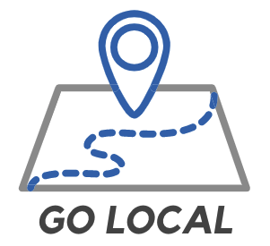

# Go Local-Microservice




## Table of Contents

-   [Description](#description)
-   [API Contract](#api-contract)
-   [Technologies Used](#technologies-used)
-   [Local Setup](#local-setup)
-   [Running the Tests](#running-the-tests)
-   [Learning Goals](#learning-goals)
-   [Authors](#authors)
-   [Statistics](#statistics)

## Description
Go Local allows travelers to experience their destinations like a local by inviting local users to suggest authentic travel experiences for visitors to enjoy. The app follows a Service-Oriented Architecture pattern and consists of:
  - a [front-end Rails application](https://github.com/Team-Go-Local/go_local_frontend), which provides a user interface;
  - a [back-end Rails application](https://github.com/Team-Go-Local/go_local_backend), which manages the app's database;
  - and a Sinatra microservice application, which retrieves information from the Google Places API.<br>

This repository houses the Sinatra microservice.

##### To view the deployed application, please visit [Go Local](https://go-local-fe.herokuapp.com) on Heroku

## API Contract

This portion of the application exposes two endpoints to be consumed by our backend application. The responses for both endpoints adhere to the [JSON:API v1.0 specifications](https://jsonapi.org/).

- `GET /api/v1/place_search`: allows local users to browse local businesses and sights they may wish to recommend to visitors<br>

  - required parameters: `location` (the name of a city, landmark, or establishment being queried by a user)
  - example query: https://go-local-maps-api.herokuapp.com/api/v1/place_search?location=casa-bonita
  - example response:
  ```
  {
    "data": {
      "id": null,
      "type": "place",
      "attributes": {
        "place_id": "ChIJE7tYRySHa4cRSauU_fDROfk",
        "formatted_address": "6715 W Colfax Ave, Lakewood, CO 80214, United States",
        "name": "Casa Bonita",
        "types": [
          "restaurant",
          "food",
          "point_of_interest",
          "establishment"
        ]
      }
    }
  }
  ```
- `GET /api/v1/place_details`: fetches more specific information about recommended sites<br>

  - required parameters: `place_id` (the id required to locate the location in Google Places API, which will have been supplied by the request made to the `place_search` endpoint)
  - example query: https://go-local-maps-api.herokuapp.com/api/v1/place_details?place_id=ChIJFaqhMyt_bIcRMfeTGF4E8kM
  - example response:
  ```
  {
    "data": {
      "id": null,
      "type": "place",
      "attributes": {
        "place_id": "ChIJFaqhMyt_bIcRMfeTGF4E8kM",
        "formatted_address": "100 W 14th Ave Pkwy, Denver, CO 80204, USA",
        "name": "Denver Art Museum",
        "types": [
          "tourist_attraction",
          "museum",
          "point_of_interest",
          "establishment"
        ],
        "formatted_phone_number": "(720) 865-5000",
        "website": "https://denverartmuseum.org/",
        "business_status": "OPERATIONAL",
        "opening_hours": [
          "Monday: 10:00 AM – 5:00 PM",
          "Tuesday: 10:00 AM – 5:00 PM",
          "Wednesday: 10:00 AM – 5:00 PM",
          "Thursday: 10:00 AM – 5:00 PM",
          "Friday: 10:00 AM – 5:00 PM",
          "Saturday: 10:00 AM – 5:00 PM",
          "Sunday: 10:00 AM – 5:00 PM"
        ]
      }
    }
  }
  ```

## Technologies Used
- Google Places API
  - [Place Search](https://developers.google.com/maps/documentation/places/web-service/search)
  - [Place Details](https://developers.google.com/maps/documentation/places/web-service/details)<br>
- Ruby v. 2.5.3
- Sinatra
- Heroku
- Travis-CI
- Dependencies:
  - Faraday
  - Fast JSON API
  - Figaro

## Local Setup
To use the project in your local environment, please follow the instructions below:

1. Apply for an API key on the [Google Maps Developer Platform](https://developers.google.com/maps/documentation/places/web-service/get-api-key). Make sure to enable the Places API for your key on the Google Cloud Platform for your project.
2. Clone the repository:<br>
  `git clone git@github.com:Team-Go-Local/go_local_microservice.git`
  `cd go_local_microservice`
3. Install gem packages
  `bundle install`
4. Install Figaro
  `figaro install`
5. Enter API Key in `config/application.yml` using the following syntax:<br>
  `MAP_API_KEY: <your api key>`
6. To launch a local server:<br>
  `shotgun`<br>
  Once the server is running you can send requests to `localhost:9393`<br>
  ex: `https://localhost:9393//api/v1/place_search?location=casa-bonita`
7. To run tests and view the test coverage report:<br>
  `bundle exec rspec`  
  `open coverage/index.html`
8. To run Rubocop:
  `rubocop`


## Learning Goals

- Utilize a Service-Oriented Architecture with a front-end, a back-end, and a micro-service
- Consume external APIs
- Build APIs that return JSON responses
- Use an external OAuth provider to authenticate users
- Deploy a production-quality user interface
- Implement an Agile workflow, including sprint planning & reviews and use of GitHub project management & code review tools

## Authors
-   Cydnee Owens | [github](https://github.com/cowens87) \| [linkedin](https://www.linkedin.com/in/cydnee-owens-5280/)
-   Gus Cunningham | [github](https://github.com/cunninghamge) \| [linkedin](https://www.linkedin.com/in/grayson-cunningham/)
-   Isabelle Villasenor | [github](https://github.com/isabellevillasenor) \| [linkedin](https://www.linkedin.com/in/isabelle-villasenor/)
-   Saundra Catalina | [github](https://github.com/saundracatalina) \| [linkedin](https://www.linkedin.com/in/saundra-catalina/)
-   Sam Yeo | [github](https://github.com/SK-Sam) \| [linkedin](https://www.linkedin.com/in/samuel-horishin-yeo/)
-   V Arruda | [github](https://github.com/nessarruda) \| [linkedin](https://www.linkedin.com/in/vanessa-alves-de-arruda/)
-   Yesi Meza | [github](https://github.com/SK-Sam) \| [linkedin](https://www.linkedin.com/in/yesimeza/)

## Statistics
<!-- Shields -->

